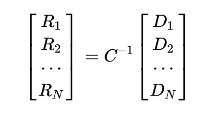

# Problem Overview
  Secret splitting
## Pt 1
- You provide a secret, the program splits it up into 100 shares, and gives you 5 of those shares. 
- Shares were generated from byte sequences, a matrix, and a prime number (random)
  

---
# Problem Overview
  Secret splitting
## Pt 1
- Using those 5 shares of the secret, you could pass them back to the program and it would reconstitue the secret.
  
- yielding the secret:
  
--- 
# Problem Overview
## Pt 2 
- You are provided 3 of the shares for the secret (flag)
- Then you could verify whether your shares correctly reconstituted the flag by passing them back to the program.
---
# Problem
You need 5 shares to reconstitute the flag, but you're only given 3

---
# Initial steps
1. Download .py file and run locally
2. Gather as much info from the source code as I could
  - What files were being generated and when
  - How the matrix is created
  - How the shares are created
  - Where the matrix and prime number are stored

---
# What I knew:
- How to generate and reverse the secret splitting
- The matrix was generated and stored in a file called matrix.ooo
- The prime number was also generated and stored in a file called prime.ooo
- The other 2 shares I needed were stored in files that correlated to the flag's ID 

---
# What I did not know:
- How to access the files
¯\\\_(ツ)_/¯

# Solution
  I spent hours and hours and hours mathing and the solution in the write up was: 
  ```
  Binary search on if secret.startswith(b"000{"):
  ```
  